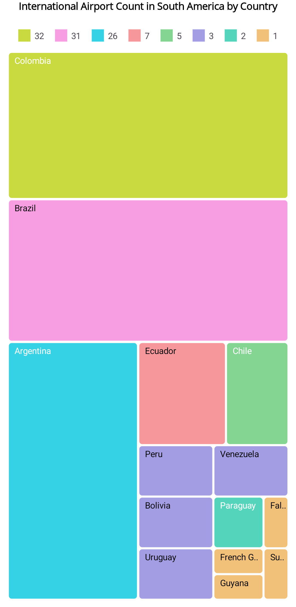

# maui-treemap

This repository contains the samples that demonstrate the functionalities of [.NET MAUI TreeMap (SfTreeMap)](https://help.syncfusion.com/maui/treemap/getting-started) control.

## Syncfusion controls

This project used the following Syncfusion control(s):
* [SfTreeMap](https://www.syncfusion.com/maui-controls/maui-tree-map)

## Creating an application using the .NET MAUI TreeMap

### Step 1: Create a new .NET MAUI application in Visual Studio

1. Go to **File > New > Project** and choose the **.NET MAUI App** template.
2. Name the project and choose a location. Then click **Next**.
3. Select the .NET framework version and click **Create**.

### Step 2: Install the Syncfusion .NET MAUI TreeMap NuGet package

Syncfusion .NET MAUI components are available in [nuget.org](https://www.nuget.org/). To add SfTreeMap to your project, open the NuGet package manager in Visual Studio, search for [Syncfusion.Maui.TreeMap](https://www.nuget.org/packages/Syncfusion.Maui.TreeMap) and then install it.

### Step 3: Initialize the control

To initialize the TreeMap control, import the TreeMap namespace.

###### XAML
```xaml
<ContentPage   
    xmlns="http://schemas.microsoft.com/dotnet/2021/maui"
    xmlns:x="http://schemas.microsoft.com/winfx/2009/xaml"
    xmlns:treemap="clr-namespace:Syncfusion.Maui.TreeMap;assembly=Syncfusion.Maui.TreeMap">

    <treemap:SfTreeMap/>
</ContentPage>
```

###### C#
```csharp
using Syncfusion.Maui.TreeMap;
...
public partial class MainPage : ContentPage
{
    public MainPage()
    {
        this.InitializeComponent();
        SfTreeMap treeMap = new SfTreeMap();
        this.Content = treeMap;
    }
}
```

### Step 4: Register the handler

Syncfusion.Maui.Core nuget is a dependent package for all Syncfusion controls of .NET MAUI. In the MauiProgram.cs file, register the handler for Syncfusion core.

```csharp
using Microsoft.Extensions.Logging;
using Syncfusion.Maui.Core.Hosting;

namespace GettingStarted
{
    public static class MauiProgram
    {
        public static MauiApp CreateMauiApp()
        {
            var builder = MauiApp.CreateBuilder();
            builder
                .UseMauiApp<App>()
                .ConfigureSyncfusionCore()
                .ConfigureFonts(fonts =>
                {
                    fonts.AddFont("OpenSans-Regular.ttf", "OpenSansRegular");
                    fonts.AddFont("OpenSans-Semibold.ttf", "OpenSansSemibold");
                });

#if DEBUG
    builder.Logging.AddDebug();
#endif

            return builder.Build();
        }
    }
}
```

### Step 5: Create a data model for TreeMap

Create a simple data model that represents a data point in the TreeMap. The model should contain properties for the values to be displayed.

###### C#
```csharp
namespace GettingStarted
{
    using System.ComponentModel;

    public class AirportDetails : INotifyPropertyChanged
    {
        private string state;
        private int count;

        public AirportDetails()
        {
            this.state = string.Empty;
        }

        public string State
        {
            get { return this.state; }
            set
            {
                this.state = value;
                this.RaisePropertyChanged(nameof(State));
            }
        }

        public int Count
        {
            get { return this.count; }
            set
            {
                this.count = value;
                this.RaisePropertyChanged(nameof(Count));
            }
        }

        public event PropertyChangedEventHandler? PropertyChanged;

        private void RaisePropertyChanged(string propertyName)
        {
            PropertyChanged?.Invoke(this, new PropertyChangedEventArgs(propertyName));
        }
    }
}
```

### Step 6: Create a view model

Now, create a ViewModel class and initialize a list of `AirportDetails` objects as follows.

###### C#
```csharp
namespace GettingStarted
{
    using System.Collections.ObjectModel;

    public class ViewModel
    {
        public ViewModel()
        {
            this.AirportDetails = this.GetAirportDetails();
        }

        public ObservableCollection<AirportDetails> AirportDetails { get; set; }

        private ObservableCollection<AirportDetails> GetAirportDetails()
        {
            return new ObservableCollection<AirportDetails>
            {
                new AirportDetails { State = "Brazil", Count = 31 },
                new AirportDetails { State = "Colombia", Count = 32 },
                new AirportDetails { State = "Argentina", Count = 26 },
                new AirportDetails { State = "Ecuador", Count = 7 },
                new AirportDetails { State = "Chile", Count = 5 },
                new AirportDetails { State = "Peru", Count = 3 },
                new AirportDetails { State = "Venezuela", Count = 3 },
                new AirportDetails { State = "Bolivia", Count = 3 },
                new AirportDetails { State = "Paraguay", Count = 2 },
                new AirportDetails { State = "Uruguay", Count = 3 },
                new AirportDetails { State = "Falkland Islands", Count = 1 },
                new AirportDetails { State = "French Guiana", Count = 1 },
                new AirportDetails { State = "Guyana", Count = 1 },
                new AirportDetails { State = "Suriname", Count = 1 }
            };
        }
    }
}
```

* Create a `ViewModel` instance and set it as the TreeMap's `BindingContext`. This enables property binding from `ViewModel` class.

* Add namespace of `ViewModel` class to your XAML Page, if you prefer to set `BindingContext` in XAML.

###### XAML
```xaml 
<ContentPage
    xmlns="http://schemas.microsoft.com/dotnet/2021/maui"
    xmlns:x="http://schemas.microsoft.com/winfx/2009/xaml"
    xmlns:treemap="clr-namespace:Syncfusion.Maui.TreeMap;assembly=Syncfusion.Maui.TreeMap"
    xmlns:local="clr-namespace:TreeMapGettingStarted">

    <treemap:SfTreeMap>
        <treemap:SfTreeMap.BindingContext>
            <local:ViewModel/>
        </treemap:SfTreeMap.BindingContext>
    </treemap:SfTreeMap>
</ContentPage>
```

###### C#
```csharp
SfTreeMap treeMap = new SfTreeMap();
this.BindingContext = new ViewModel();
this.Content = treeMap;
```

### Step 7: Populate TreeMap with data

Add [SfTreeMap](https://help.syncfusion.com/cr/maui/Syncfusion.Maui.TreeMap.SfTreeMap.html) and bind the `AirportDetails` to the [DataSource](https://help.syncfusion.com/cr/maui/Syncfusion.Maui.TreeMap.SfTreeMap.html#Syncfusion_Maui_TreeMap_SfTreeMap_DataSource) property. To plot the TreeMap, the [PrimaryValuePath](https://help.syncfusion.com/cr/maui/Syncfusion.Maui.TreeMap.SfTreeMap.html#Syncfusion_Maui_TreeMap_SfTreeMap_PrimaryValuePath) property must be configured so that the TreeMap may get values from the respective property in the data model.

###### XAML
```xaml
<treemap:SfTreeMap DataSource="{Binding AirportDetails}"
                   PrimaryValuePath="Count">
    <treemap:SfTreeMap.LeafItemSettings>
        <treemap:TreeMapLeafItemSettings LabelPath="State"/>
    </treemap:SfTreeMap.LeafItemSettings>
    <treemap:SfTreeMap.LeafItemBrushSettings>
        <treemap:TreeMapUniformBrushSettings Brush="Orange"/>
    </treemap:SfTreeMap.LeafItemBrushSettings>
</treemap:SfTreeMap>
```

###### C#
```csharp
SfTreeMap treeMap = new SfTreeMap();
ViewModel viewModel = new ViewModel();
treeMap.DataSource = viewModel.AirportDetails;
treeMap.PrimaryValuePath = "Count";
treeMap.LeafItemSettings = new TreeMapLeafItemSettings() { LabelPath = "State" };
treeMap.LeafItemBrushSettings = new TreeMapUniformBrushSettings() { Brush = Colors.Orange };
this.Content = treeMap;
```

### Step 8: Add a title

The title of the TreeMap acts as a title to provide quick information to the user about the data being displayed. You can set title using a Label or Title property as shown below.

###### XAML
```xaml
<VerticalStackLayout>
    <Label Text="International Airport Count in South America"
           FontSize="16"
           FontAttributes="Bold"
           HorizontalTextAlignment="Center"
           Padding="10"/>
    
    <treemap:SfTreeMap DataSource="{Binding AirportDetails}"
                       PrimaryValuePath="Count">
        <treemap:SfTreeMap.LeafItemSettings>
            <treemap:TreeMapLeafItemSettings LabelPath="State"/>
        </treemap:SfTreeMap.LeafItemSettings>
    </treemap:SfTreeMap>
</VerticalStackLayout>
```

###### C#
```csharp
VerticalStackLayout layout = new VerticalStackLayout();
Label title = new Label
{
    Text = "International Airport Count in South America",
    FontSize = 16,
    FontAttributes = FontAttributes.Bold,
    HorizontalTextAlignment = TextAlignment.Center,
    Padding = 10
};
layout.Add(title);

SfTreeMap treeMap = new SfTreeMap();
treeMap.DataSource = viewModel.AirportDetails;
treeMap.PrimaryValuePath = "Count";
layout.Add(treeMap);
this.Content = layout;
```

### Step 9: Enable data labels

The [TreeMapLeafItemSettings](https://help.syncfusion.com/cr/maui/Syncfusion.Maui.TreeMap.TreeMapLeafItemSettings.html) property of TreeMap can be used to enable and customize data labels to improve the readability of the TreeMap. You can configure the label path using [LabelPath](https://help.syncfusion.com/cr/maui/Syncfusion.Maui.TreeMap.TreeMapLeafItemSettings.html#Syncfusion_Maui_TreeMap_TreeMapLeafItemSettings_LabelPath) property.

###### XAML
```xaml
<treemap:SfTreeMap DataSource="{Binding AirportDetails}"
                   PrimaryValuePath="Count">
    <treemap:SfTreeMap.LeafItemSettings>
        <treemap:TreeMapLeafItemSettings LabelPath="State"/>
    </treemap:SfTreeMap.LeafItemSettings>
</treemap:SfTreeMap>
```

###### C#
```csharp
SfTreeMap treeMap = new SfTreeMap();
treeMap.DataSource = viewModel.AirportDetails;
treeMap.PrimaryValuePath = "Count";
treeMap.LeafItemSettings = new TreeMapLeafItemSettings() { LabelPath = "State" };
this.Content = treeMap;
```

### Step 10: Enable Tooltip

Tooltips are used to show information about the data items when hovering over them. Enable tooltip by setting the [ShowToolTip](https://help.syncfusion.com/cr/maui/Syncfusion.Maui.TreeMap.SfTreeMap.html#Syncfusion_Maui_TreeMap_SfTreeMap_ShowToolTip) property as true.

###### XAML
```xaml
<treemap:SfTreeMap DataSource="{Binding AirportDetails}"
                   PrimaryValuePath="Count"
                   ShowToolTip="True">
    <treemap:SfTreeMap.LeafItemSettings>
        <treemap:TreeMapLeafItemSettings LabelPath="State"/>
    </treemap:SfTreeMap.LeafItemSettings>
</treemap:SfTreeMap>
```

###### C#
```csharp
SfTreeMap treeMap = new SfTreeMap();
treeMap.DataSource = viewModel.AirportDetails;
treeMap.PrimaryValuePath = "Count";
treeMap.ShowToolTip = true;
treeMap.LeafItemSettings = new TreeMapLeafItemSettings() { LabelPath = "State" };
this.Content = treeMap;
```

### Step 11: Apply color mapping

Use the [LeafItemBrushSettings](https://help.syncfusion.com/cr/maui/Syncfusion.Maui.TreeMap.SfTreeMap.html#Syncfusion_Maui_TreeMap_SfTreeMap_LeafItemBrushSettings) property to apply color mapping to the TreeMap items. You can use either [TreeMapUniformBrushSettings](https://help.syncfusion.com/cr/maui/Syncfusion.Maui.TreeMap.TreeMapUniformBrushSettings.html) for uniform colors or [TreeMapRangeBrushSettings](https://help.syncfusion.com/cr/maui/Syncfusion.Maui.TreeMap.TreeMapRangeBrushSettings.html) for range-based colors.

###### XAML
```xaml
<treemap:SfTreeMap DataSource="{Binding AirportDetails}"
                   PrimaryValuePath="Count"
                   RangeColorValuePath="Count">
    <treemap:SfTreeMap.LeafItemBrushSettings>
        <treemap:TreeMapRangeBrushSettings>
            <treemap:TreeMapRangeBrushSettings.RangeBrushes>
                <treemap:TreeMapRangeBrush From="1" To="10" Brush="#F6989B"/>
                <treemap:TreeMapRangeBrush From="11" To="20" Brush="#35D2E5"/>
                <treemap:TreeMapRangeBrush From="21" To="32" Brush="#F79EE3"/>
            </treemap:TreeMapRangeBrushSettings.RangeBrushes>
        </treemap:TreeMapRangeBrushSettings>
    </treemap:SfTreeMap.LeafItemBrushSettings>
</treemap:SfTreeMap>
```

###### C#
```csharp
SfTreeMap treeMap = new SfTreeMap();
ViewModel viewModel = new ViewModel();
treeMap.DataSource = viewModel.AirportDetails;
treeMap.PrimaryValuePath = "Count";
treeMap.RangeColorValuePath = "Count";

TreeMapRangeBrushSettings rangeBrushSettings = new TreeMapRangeBrushSettings();
rangeBrushSettings.RangeBrushes = new List<TreeMapRangeBrush>
{
    new TreeMapRangeBrush { From = 1, To = 10, Brush = Color.FromArgb("#F6989B") },
    new TreeMapRangeBrush { From = 11, To = 20, Brush = Color.FromArgb("#35D2E5") },
    new TreeMapRangeBrush { From = 21, To = 32, Brush = Color.FromArgb("#F79EE3") }
};
treeMap.LeafItemBrushSettings = rangeBrushSettings;
this.Content = treeMap;
```

The following code example gives you the complete code of above configurations.

###### XAML
```xaml
<?xml version="1.0" encoding="utf-8" ?>
<ContentPage xmlns="http://schemas.microsoft.com/dotnet/2021/maui"
             xmlns:x="http://schemas.microsoft.com/winfx/2009/xaml"
             xmlns:treemap="clr-namespace:Syncfusion.Maui.TreeMap;assembly=Syncfusion.Maui.TreeMap"
             xmlns:local="clr-namespace:GettingStarted"
             x:Class="GettingStarted.MainPage">

    <ContentPage.BindingContext>
        <local:ViewModel/>
    </ContentPage.BindingContext>
    <Grid RowDefinitions="auto, 0.95*">
        <VerticalStackLayout>
            <Label Text="International Airport Count in South America by Country"
                   VerticalTextAlignment="Center"
                   HorizontalTextAlignment="Center"
                   FontSize="14"
                   Padding="3"
                   FontAttributes="Bold"/>
        </VerticalStackLayout>
        <treemap:SfTreeMap x:Name="treeMap"
                           x:DataType="local:ViewModel"
                           DataSource="{Binding AirportDetails}"
                           Grid.Row="1"
                           Margin="8"
                           RangeColorValuePath="Count"
                           PrimaryValuePath="Count"
                           ShowToolTip="True">
            <treemap:SfTreeMap.LeafItemSettings>
                <treemap:TreeMapLeafItemSettings LabelPath="State" Spacing="0"/>
            </treemap:SfTreeMap.LeafItemSettings>
            <treemap:SfTreeMap.LeafItemBrushSettings>
                <treemap:TreeMapRangeBrushSettings>
                    <treemap:TreeMapRangeBrushSettings.RangeBrushes>
                        <treemap:TreeMapRangeBrush LegendLabel="32"
                                                   From="32"
                                                   To="32"
                                                   Brush="#C8DA3F"/>
                        <treemap:TreeMapRangeBrush LegendLabel="31"
                                                   From="27"
                                                   To="31"
                                                   Brush="#F79EE3"/>
                        <treemap:TreeMapRangeBrush LegendLabel="26"
                                                   From="8"
                                                   To="26"
                                                   Brush="#35D2E5"/>
                        <treemap:TreeMapRangeBrush LegendLabel="7"
                                                   From="6"
                                                   To="7"
                                                   Brush="#F6989B"/>
                        <treemap:TreeMapRangeBrush LegendLabel="5"
                                                   From="4"
                                                   To="5"
                                                   Brush="#84D592"/>
                        <treemap:TreeMapRangeBrush LegendLabel="3"
                                                   From="3" 
                                                   To="3" 
                                                   Brush="#A39EE4"/>
                        <treemap:TreeMapRangeBrush LegendLabel="2"
                                                   From="2" 
                                                   To="2" 
                                                   Brush="#53D4BB"/>
                        <treemap:TreeMapRangeBrush LegendLabel="1"
                                                   From="0"
                                                   To="1"
                                                   Brush="#F1C17A"/>
                    </treemap:TreeMapRangeBrushSettings.RangeBrushes>
                </treemap:TreeMapRangeBrushSettings>
            </treemap:SfTreeMap.LeafItemBrushSettings>
            <treemap:SfTreeMap.LegendSettings>
                <treemap:TreeMapLegendSettings ShowLegend="True" />
            </treemap:SfTreeMap.LegendSettings>
            <treemap:SfTreeMap.ToolTipTemplate>
                <DataTemplate x:DataType="local:ViewModel">
                    <StackLayout Orientation="Horizontal">
                        <StackLayout Orientation="Vertical">
                            <StackLayout Orientation="Horizontal">
                                <Label Text="Airports:"
                                       Margin="8,0,0,0"
                                       TextColor="{AppThemeBinding Light=White, Dark=Black}"/>
                                <Label Text="{Binding PrimaryValueText}"
                                       Margin="5,0,8,0"
                                       TextColor="{AppThemeBinding Light=White, Dark=Black}"/>
                            </StackLayout>
                            <StackLayout Orientation="Horizontal">
                                <Label Text="Counts:" 
                                       Margin="8,0,0,0"
                                       TextColor="{AppThemeBinding Light=White, Dark=Black}"/>
                                <Label Text="{Binding Item.Count}"
                                       Margin="5,0,8,0"
                                       TextColor="{AppThemeBinding Light=White, Dark=Black}"/>
                            </StackLayout>
                        </StackLayout>
                    </StackLayout>
                </DataTemplate>
            </treemap:SfTreeMap.ToolTipTemplate>
        </treemap:SfTreeMap>
    </Grid>
</ContentPage>
```

###### C#
```csharp
using Syncfusion.Maui.TreeMap;
using System.Collections.ObjectModel;

namespace GettingStarted
{
    public partial class MainPage : ContentPage
    {
        public MainPage()
        {
            InitializeComponent();
            
            // Create ViewModel and TreeMap
            ViewModel viewModel = new ViewModel();
            SfTreeMap treeMap = new SfTreeMap
            {
                DataSource = viewModel.AirportDetails,
                PrimaryValuePath = "Count",
                RangeColorValuePath = "Count",
                ShowToolTip = true
            };
            
            // Configure Leaf Item Settings
            treeMap.LeafItemSettings = new TreeMapLeafItemSettings
            {
                LabelPath = "State",
                Spacing = 0
            };
            
            // Configure Color Range Brushes
            TreeMapRangeBrushSettings rangeBrushSettings = new TreeMapRangeBrushSettings();
            rangeBrushSettings.RangeBrushes = new List<TreeMapRangeBrush>
            {
                new TreeMapRangeBrush { LegendLabel = "32", From = 32, To = 32, Brush = Color.FromArgb("#C8DA3F") },
                new TreeMapRangeBrush { LegendLabel = "31", From = 27, To = 31, Brush = Color.FromArgb("#F79EE3") },
                new TreeMapRangeBrush { LegendLabel = "26", From = 8, To = 26, Brush = Color.FromArgb("#35D2E5") },
                new TreeMapRangeBrush { LegendLabel = "7", From = 6, To = 7, Brush = Color.FromArgb("#F6989B") },
                new TreeMapRangeBrush { LegendLabel = "5", From = 4, To = 5, Brush = Color.FromArgb("#84D592") },
                new TreeMapRangeBrush { LegendLabel = "3", From = 3, To = 3, Brush = Color.FromArgb("#A39EE4") },
                new TreeMapRangeBrush { LegendLabel = "2", From = 2, To = 2, Brush = Color.FromArgb("#53D4BB") },
                new TreeMapRangeBrush { LegendLabel = "1", From = 0, To = 1, Brush = Color.FromArgb("#F1C17A") }
            };
            treeMap.LeafItemBrushSettings = rangeBrushSettings;
            
            // Configure Legend
            treeMap.LegendSettings = new TreeMapLegendSettings { ShowLegend = true };
            
            // Create layout with title
            VerticalStackLayout layout = new VerticalStackLayout();
            Label title = new Label
            {
                Text = "International Airport Count in South America by Country",
                FontSize = 14,
                FontAttributes = FontAttributes.Bold,
                HorizontalTextAlignment = TextAlignment.Center,
                Padding = 3
            };
            layout.Add(title);
            
            Grid grid = new Grid
            {
                RowDefinitions = new RowDefinitionCollection { new RowDefinition(GridLength.Auto), new RowDefinition(0.95) }
            };
            grid.Add(layout);
            grid.Add(treeMap, 0, 1);
            
            this.Content = grid;
        }
    }
}
```

